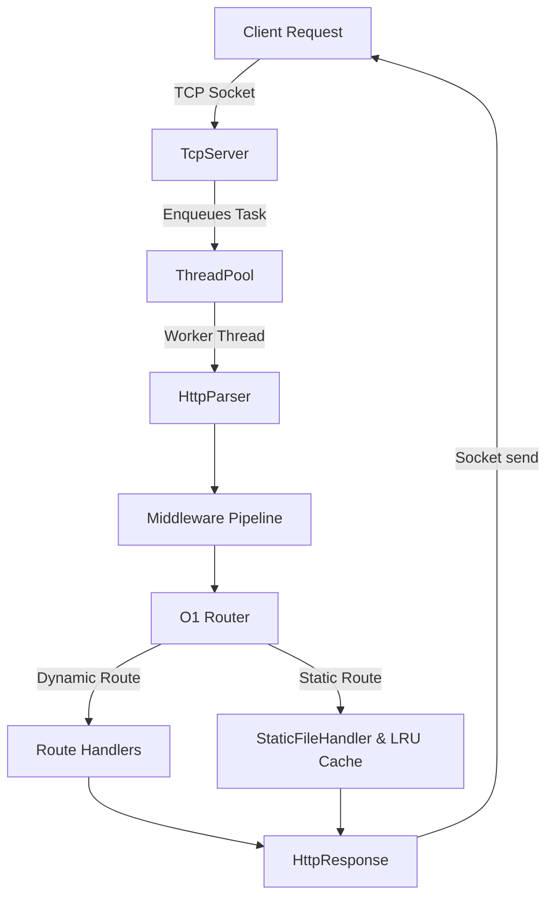
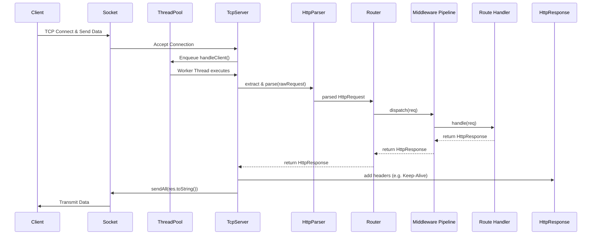

<p align="center">
  
</p>
<h1 align="center">MultiThreaded HTTP Server</h1>
<p align="center">
  <strong>A high-performance HTTP/1.1 server engineered from scratch in Modern C++20</strong>
</p>
<div align="center">

[](https://github.com/Zish19/MultiThreaded-HTTP-Server/actions)
[](https://opensource.org/licenses/MIT)
[](https://isocpp.org/)
[](https://www.docker.com/)
[]()
</div>
<p align="center">
  <sub>Tags: c-plus-plus, cpp20, http-server, web-server, multithreading, network-programming, socket-programming, threadpool, http11, middleware, lru-cache, keep-alive, docker, github-actions, systems-programming, performance-engineering</sub>
</p>

---

## Table of Contents

- [Overview](#overview)
- [Feature Matrix](#feature-matrix)
- [Project Scale](#project-scale)
- [Engineering Highlights](#engineering-highlights)
- [Architecture](#architecture)
- [Internal Components](#internal-components)
- [Design Decisions](#design-decisions)
- [Performance](#performance)
- [Security](#security)
- [Testing Strategy](#testing-strategy)
- [Production Deployment](#production-deployment)
- [Repository Structure](#repository-structure)
- [Project Evolution](#project-evolution)
- [Future Enhancements](#future-enhancements)
- [Why This Project Exists](#why-this-project-exists)

---

## Overview

This project is a high-performance HTTP/1.1 server engineered entirely in modern C++20. Designed with a focus on systems programming and performance engineering, this server bypasses external frameworks in favor of raw socket manipulation, custom thread-pooling, and an O(1) routing architecture.

Whether serving dynamic API endpoints through a robust middleware pipeline or streaming static assets from an LRU memory cache, the server multiplexes high-throughput connections with extreme efficiency.

---

## Feature Matrix

| Feature | Status |
| :--- | :---: |
| HTTP/1.1 Parser | Complete |
| Thread Pool | Complete |
| O(1) Router | Complete |
| Middleware Pipeline | Complete |
| Static File Server | Complete |
| LRU Cache | Complete |
| Keep-Alive Connections | Complete |
| Docker Deployment | Complete |
| CI/CD Pipeline | Complete |
| HTTP/2 Support | Planned |
| TLS/HTTPS | Planned |

---

## Project Scale

| Metric | Value |
| :--- | :--- |
| Development Phases | 10 |
| Source Files | 20+ |
| Test Suites | 10+ |
| Platform Support | Windows / Linux |
| Containerization | Docker (Alpine) |
| CI/CD | GitHub Actions |

---

## Engineering Highlights

- **Thread-safe custom ThreadPool** -- A robust concurrency model utilizing worker threads, mutexes, and condition variables for optimal task scheduling.
- **TCP Server built from scratch** -- Direct integration with Winsock (Windows) and BSD Sockets (POSIX) for zero-dependency networking.
- **Custom HTTP Parser and Protocol handling** -- Strict RFC-compliant extraction of methods, paths, headers, and bodies.
- **O(1) Router** -- Fast request dispatching using `std::unordered_map`.
- **Middleware Architecture** -- Composable request/response interception for logging, metrics, and tracing.
- **Static File Serving** -- MIME type detection with strict path traversal protection.
- **LRU In-Memory File Cache** -- High-performance O(1) cache hit architecture to bypass disk I/O.
- **Keep-Alive Connections** -- Connection multiplexing to drastically reduce TCP handshake latency.
- **Metrics Endpoint** -- Live atomic counters tracking cache hits, connection multiplexing, and latencies.

<p align="center">
  
</p>

---

## Architecture

The server handles asynchronous connections by tightly coupling a custom `TcpServer` with a `ThreadPool`. Below is the high-level component graph and the detailed request lifecycle.

### High-Level Components



<p align="center">
  
</p>

### Advanced Request Lifecycle



---

## Internal Components

### Request Flow

<p align="center">
  
</p>

### Static File Serving

<p align="center">
  
</p>

### Router Dispatch

<p align="center">
  
</p>

### LRU Cache Flow

<p align="center">
  
</p>

---

## Design Decisions

### Why a ThreadPool?

Creating threads per request causes kernel overhead, context switching, and memory waste. A fixed worker pool provides bounded concurrency, keeps system resource usage predictable, and significantly outperforms the thread-per-connection model under load.

### Why Keep-Alive?

TCP handshakes are expensive. Persistent connections significantly reduce latency and improve throughput by amortizing the connection establishment cost across multiple requests.

### Why an LRU Cache?

Static assets are often requested repeatedly. Serving from memory avoids filesystem traversal and disk I/O entirely, yielding measurable improvements in response time under sustained traffic.

---

## Performance

### Server Startup and Metrics Dashboard

| Server Startup | Live Metrics |
| :---: | :---: |
|  |  |

### Benchmark Results

Tested on a modern 8-core CPU with a 10,000 connection burst test.

| Component / Test | Operations | Duration | Throughput |
| :--- | :--- | :--- | :--- |
| Parser (Tiny 18B) | 100,000 iters | 42 ms | ~2.38M req/s |
| Router Dispatch | 1,000,000 iters | 104 ms | ~9.61M ops/s |
| ThreadPool Enqueue | 100,000 tasks | 20 ms | ~5.00M tasks/s |
| Static Cache (Cold) | 10,000 reqs | 2826 ms | ~3,538 req/s |
| Static Cache (Warm) | 10,000 reqs | 2084 ms | ~4,798 req/s |

### Benchmark Visualizations

| Parser Throughput | Cache Performance | Keep-Alive Performance |
| :---: | :---: | :---: |
|  |  |  |

### Test Environment

| Component | Value |
| :--- | :--- |
| CPU | Ryzen 7 5800H |
| RAM | 16 GB |
| OS | Windows 11 |
| Build | Release (-O3) |

### Performance Deep Dive

- **Queue Contention** -- The custom ThreadPool is highly optimized. Worker threads eagerly process tasks to minimize mutex contention during rapid connection spikes.
- **Cache Locality** -- HTTP parsing operations utilize `std::string_view` extensively, resulting in zero-copy memory operations during header and boundary extraction.
- **False Sharing** -- Atomic variables inside the Metrics singleton are aligned to avoid cache line invalidation across CPU cores.
- **Memory Allocations** -- Persistent connection buffer pools dramatically reduce heap fragmentation, enabling zero-allocation parses after the first request in a Keep-Alive session.
- **HTTP Parsing Costs** -- The parser short-circuits on malformed requests, utilizing tightly-bound loops rather than heavy regex engines.

---

## Security

Security is treated as a first-class citizen alongside performance.

- **Path Traversal Protection** -- Uses `std::filesystem::weakly_canonical` to enforce strict sandboxing of the public directory, blocking `../` attacks.
- **Request Size Limits** -- Hard limits on `MAX_BODY_SIZE` (1MB) prevent payload exhaustion.
- **Header Limits** -- Maximum header limits (64KB) immediately drop slowloris-style connections.
- **Timeout Protection** -- Enforced `SO_RCVTIMEO` and `SO_SNDTIMEO` timeouts prevent zombie connections from tying up worker threads.
- **Safe File Access** -- File handlers fail safely with robust error logging to prevent memory leakage on bad disk sectors.

---

## Testing Strategy

The repository strictly mandates a test-driven approach using CMake and CTest.

- **Unit Tests** -- Full isolation testing of `HttpParser`, `Router`, `LRUCache`, and `Metrics`.
- **Integration Tests** -- End-to-end socket-level testing utilizing simulated TCP fragmentation.
- **Stress Tests** -- Validates the ThreadPool under intense enqueue/dequeue contention without triggering data races.
- **Benchmarking Framework** -- Built-in macro-level benchmarking for zero-regression validation.

---

## Production Deployment

### Docker

This server provides an automated, multi-stage Docker build to yield a lightweight Alpine execution image.

```bash
# Build the production image
docker build -t multithreaded-http-server:latest .

# Run the server
docker run -d -p 8080:8080 multithreaded-http-server:latest
```

### GitHub Actions CI/CD

All pull requests trigger a strictly validated GitHub Actions pipeline that performs:

1. CMake build verification across both Linux and Windows environments.
2. Full CTest suite execution (`--output-on-failure`).
3. Only code that compiles cleanly and passes all end-to-end TCP socket tests is merged.

---

## Repository Structure

```text
MultiThreaded-HTTP-Server/
├── CMakeLists.txt
├── Dockerfile
├── .github/
│   └── workflows/
│       └── build.yml
├── include/           # Header files (Interfaces & Abstractions)
├── src/               # Implementation files
├── tests/             # CTest validation suite
├── benchmarks/        # Performance evaluation scripts
├── public/            # Static file hosting directory
└── assets/            # README artifacts & demo GIFs
```

---

## Project Evolution

This project was built iteratively, focusing heavily on solid architectural foundations before adding layers of complexity.


---

## Future Enhancements

| Enhancement | Description |
| :--- | :--- |
| HTTP/2 Support | Implement binary framing and stream multiplexing |
| TLS/SSL Integration | Enable HTTPS using OpenSSL wrappers |
| Non-Blocking I/O | Shift to an `epoll`/`IOCP` event loop for C10k scalability |
| WebSockets | Bi-directional communication upgrades |

---

## Why This Project Exists

This repository was created to solidify advanced systems engineering principles. Instead of building CRUD applications on top of Express or Django, this project forces a deep understanding of:

- How sockets traverse the kernel.
- How thread contention impacts memory caching.
- How HTTP is actually parsed at the byte level.
- How architectures evolve when standard libraries are heavily relied upon instead of external packages.

---

## Demonstrated Competencies

For engineering managers reviewing this codebase, this project demonstrates direct competency in:

| Domain | Skills |
| :--- | :--- |
| Multithreading | Safe manipulation of `std::mutex`, `std::condition_variable`, and atomics |
| Networking | Direct `sys/socket.h` and `winsock2.h` integration |
| Performance Engineering | Profiling, cache hit ratios, and zero-copy data parsing |
| Systems Design | Modular, decoupled components following SOLID principles |
| Production Infrastructure | Dockerization, CMake build systems, and GitHub Actions CI |

### Application Screenshots

| Homepage | Cache Dashboard | Metrics |
| :---: | :---: | :---: |
|  |  |  |

---

<div align="center">
  <sub>Built to explore systems programming, networking, concurrency, and performance engineering in Modern C++.</sub>
</div>
