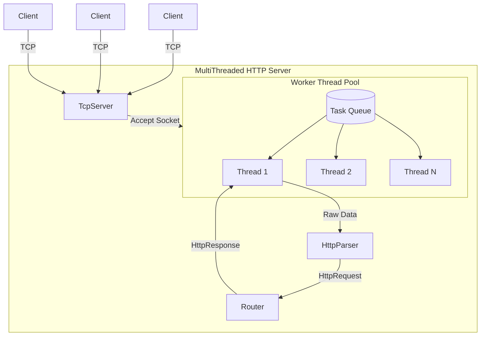

# MultiThreaded HTTP Server

A high-performance, multithreaded HTTP/1.1 server built from scratch in Modern C++20.

## Project Overview
This project is an open-source, fully functional HTTP server designed for maximum throughput and minimal latency. It handles raw TCP socket management, robust HTTP parsing, and thread-safe request routing without relying on external networking libraries like Boost.Asio or libuv.

## Why I Built This
This project was built to gain deep, low-level expertise in network programming, concurrency, and performance optimization. By reinventing the wheel (building an HTTP parser and thread pool from scratch), it provides a rigorous understanding of what happens under the hood of production web servers like Nginx or Node.js.

## Technical Highlights
- **Custom ThreadPool**: A synchronized worker pool utilizing `std::condition_variable` and a `MoveOnlyTask` wrapper to handle concurrent connections.
- **Move-only Task System**: Eliminates unnecessary object copies when dispatching work to the background threads.
- **HTTP/1.1 Parser**: A strict, security-conscious parser designed to guard against malformed requests and enforce memory limits.
- **O(1) Router**: A highly efficient nested hash-map router differentiating between `404 Not Found` and `405 Method Not Allowed`.
- **Metrics Subsystem**: Thread-safe atomic counters tracking active connections, bytes transferred, and uptime.
- **End-to-End Integration Tests**: Fully automated tests using local sockets to verify request/response lifecycle.
- **Internal Benchmark Suite**: A custom C++ micro-benchmarking tool testing the raw boundaries of the Parser and ThreadPool logic.

## Architecture



## Project Structure

- `include/`: Header files defining the core classes and interfaces.
- `src/`: Implementation files.
- `tests/`: Unit and integration tests verifying component behavior.
- `benchmarks/`: The `BenchmarkRunner` for profiling internal latency and throughput.
- `docs/`: Release checklists and supplementary documentation.

## Build Instructions

This project requires a C++20 compliant compiler and CMake 3.20+.

```bash
git clone https://github.com/yourusername/MultiThreaded_HTTP_Server.git
cd MultiThreaded_HTTP_Server
cmake -B build -S . -DCMAKE_BUILD_TYPE=Release
cmake --build build --parallel
```

## Running Locally

Run the server natively after building:

```bash
./build/HttpServer
```

*(On Windows, the binary may be located at `build\Release\HttpServer.exe`)*

## Running with Docker

The easiest way to run the server in a production-ready environment is using Docker Compose.

```bash
docker-compose up --build -d
```
The server will start on `http://localhost:8080`.

## Running Tests

Tests are integrated with CTest.

```bash
cd build
ctest -C Release --output-on-failure
```

## Benchmark Results

### Environment
- **CPU:** [Insert CPU Model]
- **RAM:** [Insert RAM Size]
- **Compiler:** MSVC / GCC / Clang
- **Build Type:** Release

### External Load Test
**Test Command:**
```bash
wrk -t4 -c100 -d30s http://localhost:8080/health
```

**Results:**
- Requests/sec: _____
- Average Latency: _____
- P95 Latency: _____
- P99 Latency: _____
- Concurrent Connections: _____

## Future Roadmap
- **Phase 7: Middleware Architecture** (Request Logging, Metrics, Authentication)
- **Work-Stealing Queues** for improved ThreadPool contention.
- **Zero-copy Request Parsing** using `std::string_view` throughout the pipeline.
- **Keep-Alive Support** to reduce TCP handshake overhead.
